# Mentor-Mentee-Project

### Documentation

####  Pre-requisites

```
- Ubuntu 22.04LTS
- Frappe -V 13.23.0
- node,yarn
- Node.js 14+
-  Redis 5                                       (caching and real time updates)
- MariaDB 10.3.x / Postgres 9.5.x               (to run database driven apps)
- yarn 1.12+                                    (js dependency manager)
-  pip 20+                                       (py dependency manager)
- wkhtmltopdf (version 0.12.5 with patched qt)  (for pdf generation)
- cron                                          (bench's scheduled jobs: automated certificate renewal, scheduled backups)
- NGINX          
- python -V 3.8.10
- Bench -V 5.8.1
- Understanding of LMS
- Basic of HTML, CSS, Python, JavaScript
```

## Requirements :

```
- Proper use of RDBMS
- Create three table [Student Table, Mentor Table, Relation Table]
- In student Table should contain the details of the student
- In Mentor Table should contain the details of the Mentor
- In Relation Table should contain the primary key of student and mentor
- fetch the database value using SQL Query on the webpage
- Search Button
- Searching, Sorting & Filtering
```

### Steps to design Mentor-Mentee Project :

#### Step 1:

- Login in the frappe

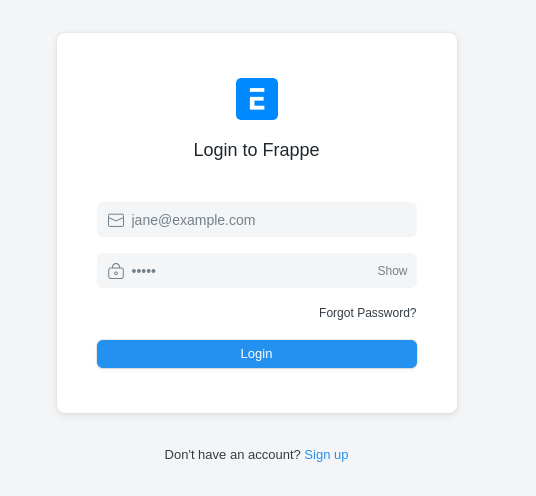

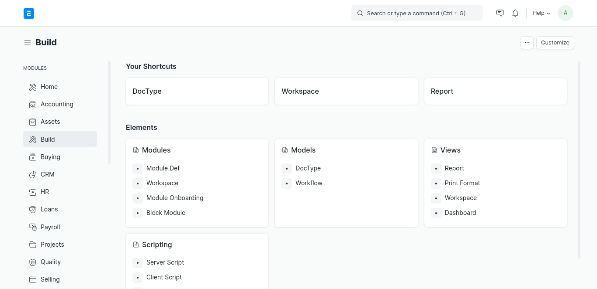

#### Step 2 cretae Doctype:

- Go to build and click on the doctype after this click on new doctype and create your first doctype student.
- Doctype name Student, module name Education
- Check on Quick Entry, Track changes
- Add fields in the fields section like- Name, Roll No., Email etc.

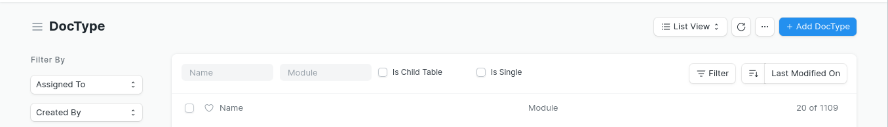

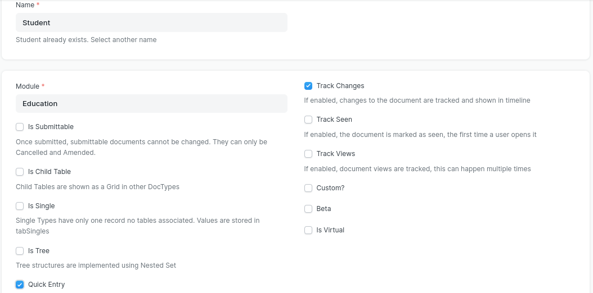

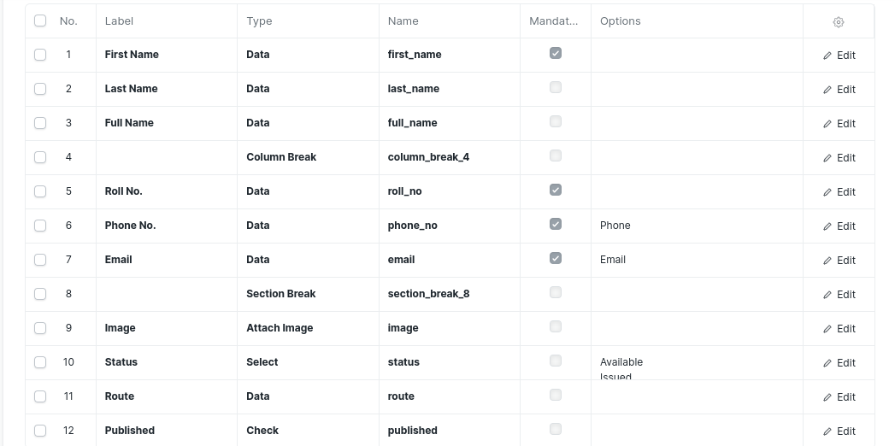

- In Full Name field click on edit button and select read only.
- In Roll NO. field click on edit button and select unique.
- In Route field click on edit button and set default route like students.
- In Published field click on edit button and set default value is 1.
- After this scroll down and set Naming st.####### and tick on has web view, allow guest to view, in route write stuents and in published write published.

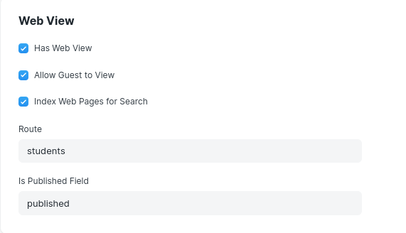

- After this click on save button. Now you can see that Student Doctype is created and to fetch the first name and last name as full name to add the python code on mentee.py location frappe-bench/apps/erpnext/erpnext/education/doctype/mentee/.

```
# Copyright (c) 2022, Frappe Technologies Pvt. Ltd. and contributors
# For license information, please see license.txt

# import frappe
from frappe.website.website_generator import WebsiteGenerator

class Mentee(WebsiteGenerator):
    #this method will run every time a document is saved
    def before_save(self):
        self.full_name = f'{self.first_name} {self.last_name or ""}'

```

##### NOTE

If the above snippet doesn't work for you , make sure server side scripts are enabled, and then restart bench

```
bench --site <your_site> set-config server_script_enabled true
```


#### Step 3 Add Student details in the dcotype :

- After save that on the right hand you can see the GO to Student List click on it.


- Now click on add Mentee/Student.

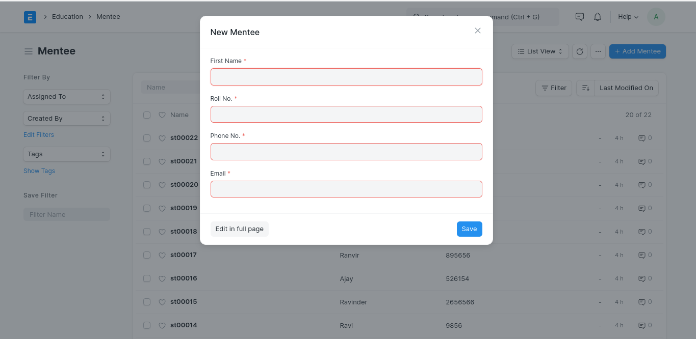

- After this student details saved you can see that on the upper screensort.
- Click on the student Id and see the details after this click on the right side option see on website.

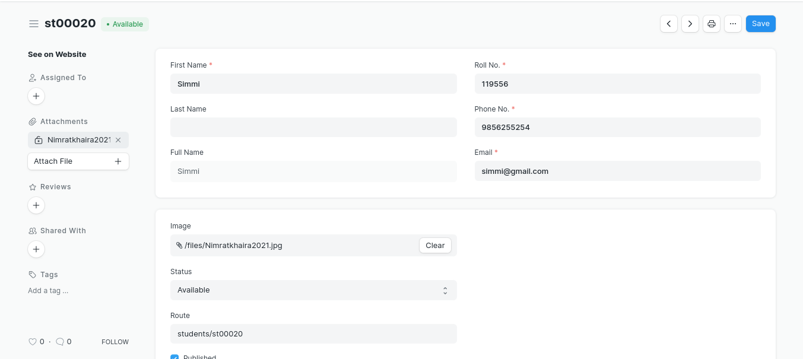

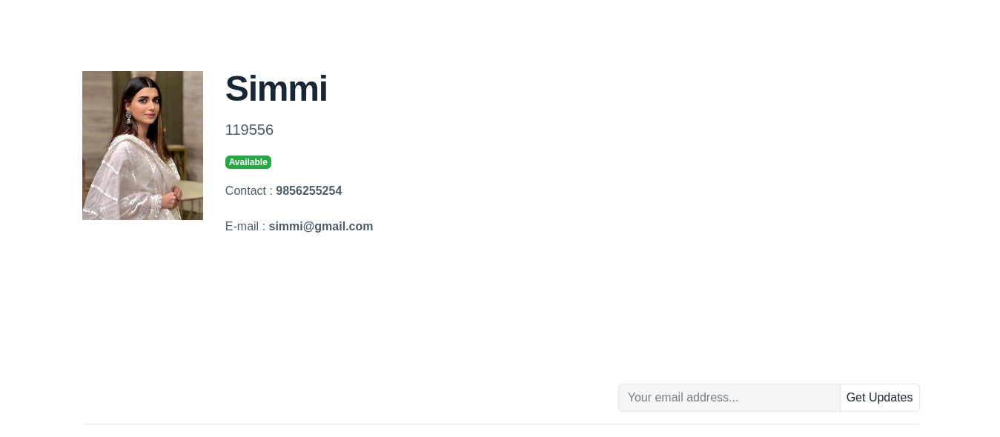

Create the webpage like this add the html code in the mentee.html
to open this file frappe-bench/apps/erpnext/erpnext/education/doctype/mentee/templates/mentee.html

Paste it on mentee.html

```




<div class="py-20 row">

    <div class="col-sm-2">

        

    </div>

    <div class="col">

        <h1>{{ full_name }}</h1>

        <p class="lead"> {{ roll_no }}</p>

        <div>

            

            <span class="badge badge-success">Available</span>
            

            <span class="badge badge-primary">Issued</span>

            

        </div>

        <div class="mt-4">

                <div>Contact : <strong>{{ phone_no }}</strong></div><br>

                <div>E-mail : <strong>{{ email }}</strong></div><br>
```

- open mentee_row.html in same location and paste it.

```<div class="py-8 row">

    <div class="col-sm-1">


    </div>

    <div class="col">

        <a class="font-size-lg" href="{{ doc.route }}">{{ full_name }}</a>

        <p class="text-muted"> {{ roll_no }}</p>

    </div>

</div>
```

#### Step 4 See the details on the database :

- Open the Bench directory and type the command.

```
bench --site <your_site> mariadb
```

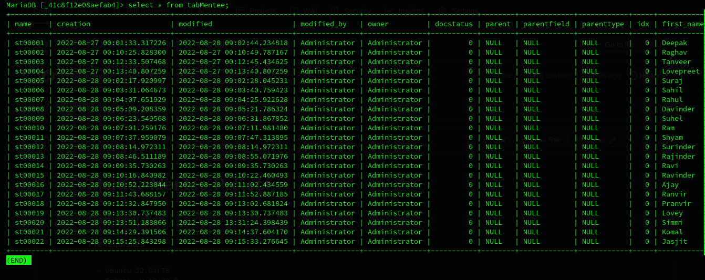


#### Step 5 Create Mentor Doctype :

All the steps are same to create a mentor dcotype.
That's why I'm not writing again.

I have add screenshots of mentor Doctype for some references.

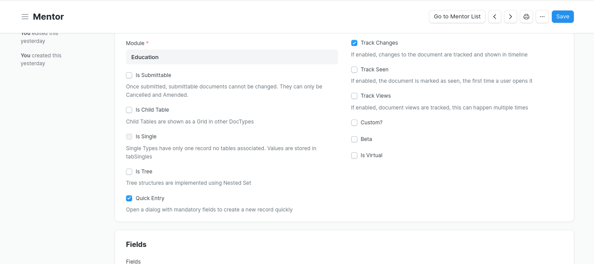

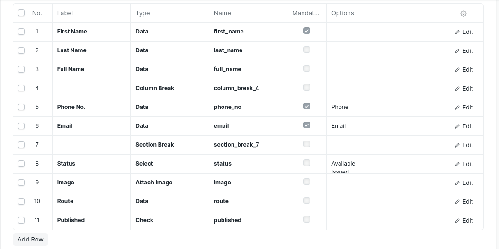

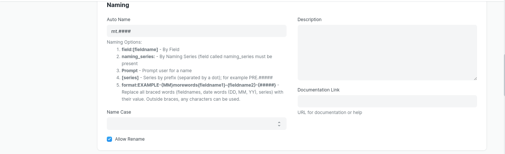

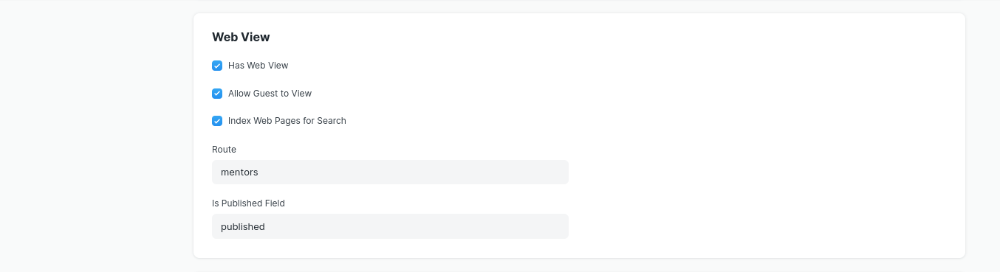

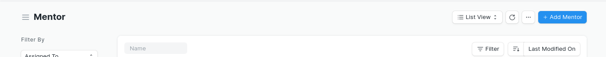

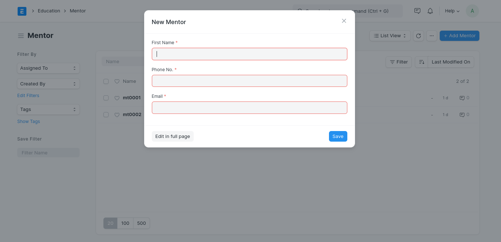

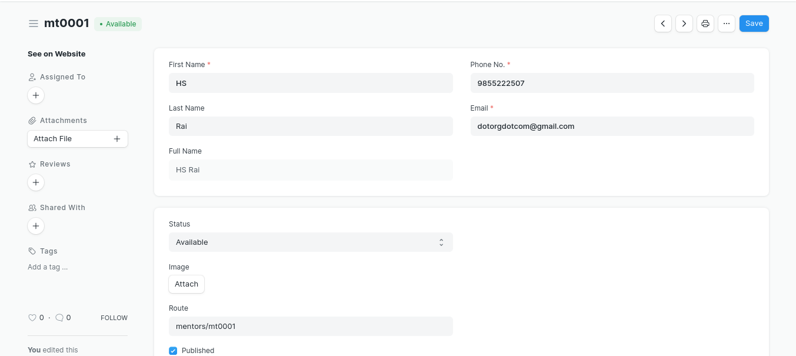

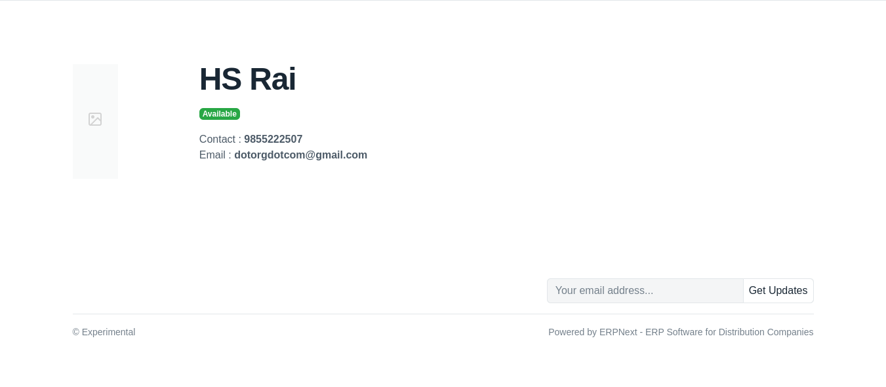

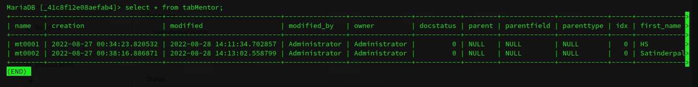


#### Step 6 Create Relation Doctype :


All the steps are same.


